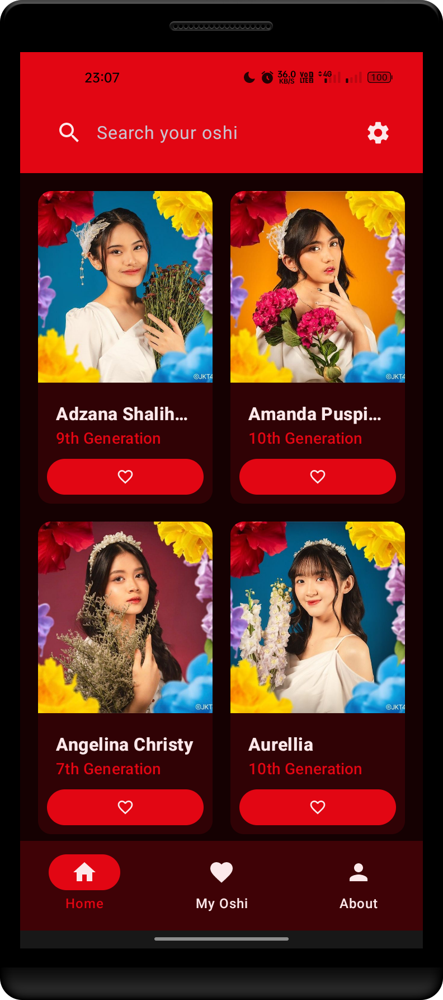

# Oshi Kita

**Oshi Kita** is a tribute Android application dedicated to [JKT48](https://jkt48.com). This application is built using Kotlin. This is a compose version to the [previous version](https://github.com/fauzan-radji/oshi-kita).

## Screenshots

Here are some screenshots of the app

  
  
  
  

## Features

- :white_check_mark: List of JKT48 member
- :white_check_mark: Detail of JKT48 member
- :white_check_mark: Search JKT48 member
- :white_check_mark: Add JKT48 member to oshi (favorite)
- :white_check_mark: Remove JKT48 member from oshi
- :white_check_mark: List of oshi JKT48 member
- :white_check_mark: Detail search oshi
- :white_check_mark: About page

## Supported Language

- :indonesia: Indonesian
- :us: English
